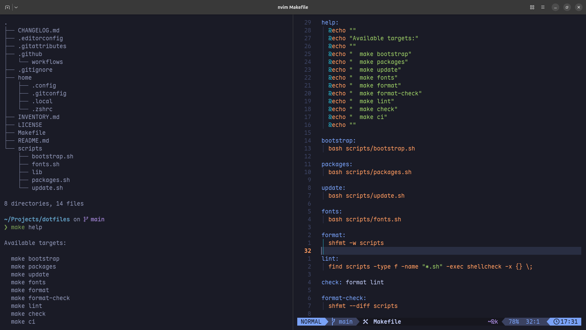

# Dotfiles

[](https://github.com/enginsezen/dotfiles/actions/workflows/ci.yml)
[](LICENSE)
[](https://github.com/enginsezen/dotfiles/releases)

A reproducible Ubuntu development environment focused on a clean terminal experience, modern CLI tools, automated setup, and version-controlled configuration.

---

## Preview

<p align="center">
  
</p>

---

## Features

- 🖥️ Ghostty
- 🐚 Zsh
- 🚀 Starship
- ✏️ Neovim (LazyVim)
- 📝 Git
- 📊 btop
- 🐳 LazyDocker configuration
- 🔤 Maple Mono Nerd Font
- ⚙️ GitHub Actions CI

---

## Repository Structure

```text
.
├── .github/
│   └── workflows/
│       └── ci.yml
│
├── home/
│   ├── .config/
│   │   ├── btop/
│   │   ├── ghostty/
│   │   ├── lazydocker/
│   │   │   └── config.yml
│   │   ├── nvim/
│   │   ├── starship.toml
│   │   └── zsh/
│   │       ├── aliases.zsh
│   │       ├── exports.zsh
│   │       └── functions.zsh
│   │
│   ├── .gitconfig.example
│   └── .zshrc
│
├── scripts/
│   ├── lib/
│   │   └── common.sh
│   ├── bootstrap.sh
│   ├── fonts.sh
│   ├── packages.sh
│   └── update.sh
│
├── CHANGELOG.md
├── INVENTORY.md
├── LICENSE
├── Makefile
└── README.md
```

---

## Quick Start

Clone the repository.

```bash
git clone https://github.com/enginsezen/dotfiles.git
cd dotfiles
```

Install required packages.

```bash
make packages
```

Configure Git.

```bash
cp home/.gitconfig.example home/.gitconfig
```

Edit `home/.gitconfig` and replace:

- `Your Name`
- `your@email.com`

with your own Git identity.

Create symbolic links.

```bash
make bootstrap
```

Install Maple Mono Nerd Font.

```bash
make fonts
```

> [!NOTE]
> This repository provides a `.gitconfig.example` template. Configure it with your own Git identity before running `make bootstrap`.

---

## Installed vs Managed

This repository distinguishes between **installing applications** and **managing their configuration**.

Some applications are installed automatically through `make packages`, while others are only configured if they are already installed on the system.

| Application | Installed | Configuration |
|-------------|:---------:|:-------------:|
| Zsh | ✅ | ✅ |
| Starship | ✅ | ✅ |
| Neovim | ✅ | ✅ |
| btop | ✅ | ✅ |
| Ghostty | ❌ | ✅ |
| LazyDocker | ❌ | ✅ |

---

## Available Commands

| Command | Description |
|---------|-------------|
| `make help` | Show available commands |
| `make bootstrap` | Create symbolic links |
| `make packages` | Install required packages |
| `make update` | Update the operating system |
| `make fonts` | Install Maple Mono Nerd Font |
| `make format` | Format all shell scripts |
| `make format-check` | Verify formatting without modifying files |
| `make lint` | Run ShellCheck |
| `make check` | Format and lint scripts |
| `make ci` | Run the same validation as GitHub Actions |

---

## Development Workflow

Before pushing changes, run:

```bash
make ci
```

This performs the same validation as the GitHub Actions workflow.

---

## Managed Applications

The following application configurations are maintained by this repository.

| Application | Status |
|-------------|:------:|
| Ghostty | ✅ |
| Zsh | ✅ |
| Starship | ✅ |
| Neovim (LazyVim) | ✅ |
| btop | ✅ |
| LazyDocker | ✅ |

---

## Philosophy

- Keep configuration under version control.
- Keep installation reproducible.
- Separate application installation from configuration management.
- Prefer simple, maintainable solutions.
- Automate repetitive setup tasks.
- Follow consistent coding standards.
- Keep scripts idempotent.
- Validate every change through Continuous Integration.

---

## License

Released under the MIT License.
